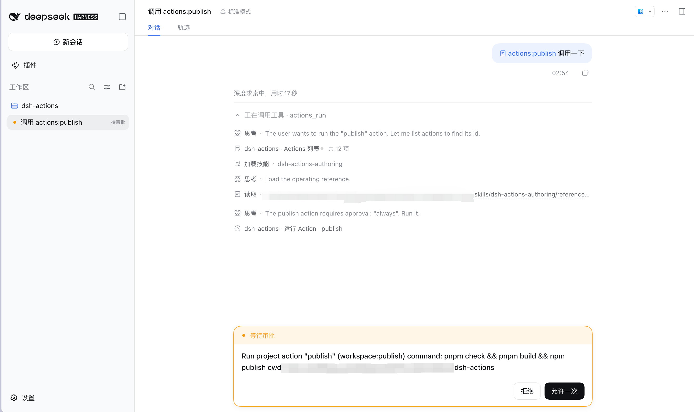
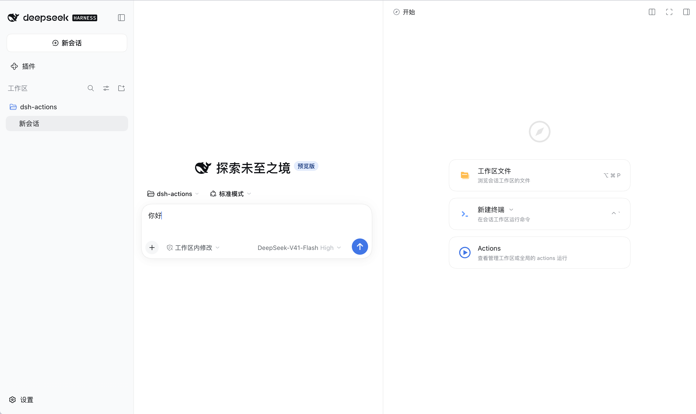
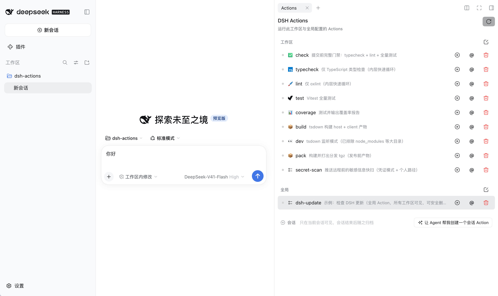
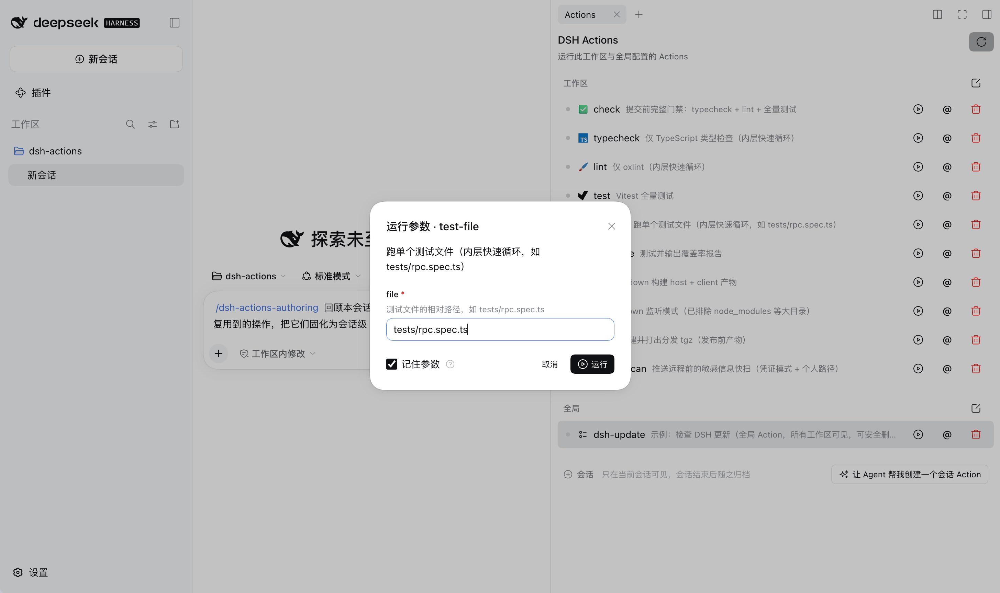
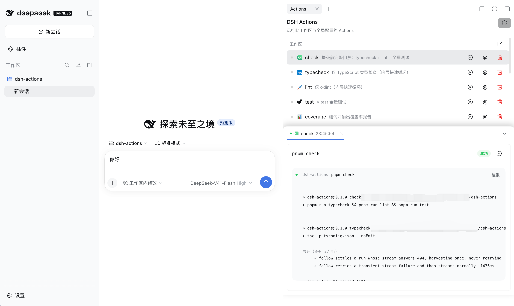
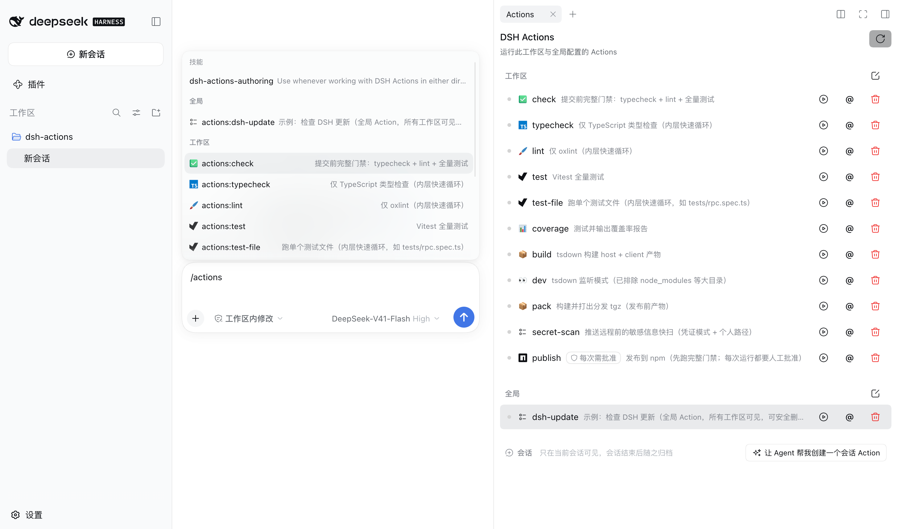

# DSH Actions

> 项目任务的一键启动器——面板上点一下就能跑；Agent 帮你把命令写成任务；固化后全项目共享，临时任务随会话用完即弃。

工作中总有一组反复要跑的命令：build、test、部署脚本、平台 API……每次都要回忆命令怎么拼、切换窗口、复制粘贴输出。Agent 也一样：临时处理这些任务时，要查文档、编写、运行、调试，多轮循环才跑通一次——而同样的工作，下一个会话又从头再来，token 就这样一遍遍烧掉。VS Code Tasks 的答案是"不用离开编辑器"；DSH Actions 更进一步——**不用离开对话，而且跑一次就固化**：人在面板上点一下，Agent 在会话里说一句话，输出就在同一个工作区里实时出现，人和 Agent 都不用再来第二遍。

核心价值按序是：

1. **给人一个快捷启动方式**——右侧面板里每个任务都是一次点击，不用再回忆命令；
2. **Agent 参与构建**——编写和固化任务由 Agent 完成：一句指令把一个复杂命令变成可复用任务，多步流程写成脚本也交给 Agent 编码，复杂任务的创建因此变得廉价；
3. **固化与复用**——工作区层随仓库提交，就是团队共享（新同事 clone 下来就有全套任务）；全局层是个人跨项目；只在当前会话有意义的任务放会话层，用完即弃，经得起用的再提升到文件层；
4. **人与 Agent 共用同一套定义**——同一个 `actions.json` 同时是人的面板和 Agent 的工具集：人固化一次，Agent 在任何会话里都能调用；Agent 在工作中固化的任务，人点开就能复跑。围绕这条主线还有更值得探索的方向——让 Agent 沉淀的会话任务持续提升为团队共享资产、让人与 Agent 围绕同一任务集互相补齐上下文。



而且**输出不只是文本**：实时流式出现在 run tab 工作区，状态徽章一眼可读；失败即停、随时重跑；重复触发不会起重复实例，而是定位到正在跑的那个；把任务或某次运行以 chip 引用发给 Agent，就能接着输出继续追问。高危任务还有一层 VS Code Tasks 没有的东西：**审批闸门**——标记过的任务，无论人点还是 Agent 调，都要经过你的显式确认才会启动。

配置的唯一来源是独立的 `actions.json`（JSONC）——不提供、也不计划提供对其他任务格式的运行时导入或桥接。

## 安装

在 DSH 的 web profile 里安装并重启：

```bash
cd ~/.dsh/profiles/web
npm install dsh-actions
# 重启 DSH Web
```

**从源码安装（仅开发本插件时）**：clone 本仓库后——

```bash
dsh plugin --profile web add /path/to/dsh-actions
```

装好后打开右侧栏的「开始」页，Actions 卡片就在那里。

## 界面

| 右侧栏入口 | 面板总览 | 参数 Modal |
| --- | --- | --- |
|  |  |  |
| **运行输出** | **`/actions:` 引用菜单** | |
|  |  | |

## 30 秒跑通

在工作区根目录写 `.dsh/actions.json`：

```jsonc
{
  "version": "1.0.0",
  "actions": [
    { "label": "check", "command": "pnpm check", "detail": "类型检查 + lint + 全部测试" }
  ]
}
```

打开右侧栏「开始」页的 **Actions** 卡片，点 `check` 旁的运行——输出在下方的 run tab 工作区实时流出。这就是完整闭环：写配置 → 面板点击 → 看输出。保存配置文件即自动生效，无需刷新。

## 使用场景

三个典型场景各有详述文档：

- **[桥接现有脚本入口](docs/scenarios/01-bridge-scripts.md)**：npm scripts / Makefile / Taskfile 太分散？让 Agent 一次性策展固化成 `.dsh/actions.json`，面板与 Agent 共用统一入口；
- **[打通 CI/发布流水线](docs/scenarios/02-ci-pipeline.md)**：以 Jenkins 为例，把平台 API 固化成 Actions——触发构建、查询状态、参数化发布（`inputs` + `approval` 的真实用法）；
- **[会话草稿本](docs/scenarios/03-session-scratchpad.md)**：只在当前会话有意义、但需要反复执行的临时任务，Agent 注册、随用随弃、用得好再提升到文件层。

更完整的示例（`runOptions`、`inputs`、`approval`）见[桥接现有脚本入口](docs/scenarios/01-bridge-scripts.md)与[配置参考](docs/features/configuration.md)。

> 欢迎补充：告诉我们你是怎么用的、你有什么需求——场景库会随真实用法持续生长。

## 项目起源

日常工作中经常会遇到需要反复执行的步骤或流程。每次临时组织这些步骤，开始时看起来很方便，但执行结果可能不稳定，也难以可靠复现。把它们固定成 CLI、MCP 服务或自定义 Slash Command，虽然获得了复用能力，却也可能过早固化接口，使后续持续调整和优化变得笨重。

把脚本放进 Agent Skill 则走向了另一个方向：它足够灵活，也可以由 Agent 推动演进，但这意味着脚本的完整生命周期需要由 Agent 主导。这样的脚本不容易作为项目的共享能力被统一发现、治理和维护，也很难把完全相同的工具同时暴露到 Web UI，让人可以直接发现和使用。

这构成了 DSH Actions 的起点。我们设想的方案在一个重要方面与 Apple 快捷指令、VS Code Tasks 和 GitHub Actions 相似：使用一份跟随工作区的定义来描述可重复执行的 Action 或流程。这份定义既可以由人有意识地持续改进，也可以在 Agent 驱动下逐步演进，同时保持可审查、可管理。随后，同一个 Action 以两种形态对外提供：

- 作为结构化工具，供 Agent 发现和调用；
- 作为 DSH Web 中的可视化界面，供人查看和操作。

Skills 和 MCP 已经为面向 Agent 的能力提供了很好的实现范式。Agent 不需要一开始就在上下文中获得所有实现细节：系统可以先提供有限、精炼的能力描述，只在真正需要时渐进式披露参数、约束、执行细节和结果。DSH Actions 希望把这种渐进式披露方式用于项目中的可重复操作，同时避免让 Agent 成为这些脚本生命周期的唯一所有者，也不把人排除在同一套工具之外。

## 三层设计：全局 × 工作区 × 会话

同一个动作，放在哪一层决定了**谁能看到它、它活多久**——这是 DSH Actions 最有特色的设计。三层按优先级 `全局 < 工作区 < 会话` 逐字段合并，同名时上层胜出：

| 层 | 位置 | 谁能看到 | 生命周期 | 典型用途 |
|---|---|---|---|---|
| **全局** | `~/.dsh/actions.json` | 你的所有工作区 | 跟随文件 | 个人习惯命令（查版本、查磁盘、开常用工具） |
| **工作区** | `<repo>/.dsh/actions.json` | 该项目的所有人与 Agent | 随仓库提交 | 项目的 build/test/部署——新同事 clone 即有全套 |
| **会话** | 会话自己的目录 | 仅当前会话 | 会话结束即归档 | Agent 工作中沉淀的临时任务、一次性的环境变体 |

三层不是并列的三个配置，而是一条**任务的成长路径**：

```text
会话层（Agent 随手固化）  ──提升──▶  工作区层（团队共享）  ──提炼──▶  全局层（个人通用）
   用完即弃                    随仓库走                     跨项目复用
```

- **合并而非隔离**：工作区可以在全局的同名任务上只改一个字段（比如覆盖 `command` 加参数、或补一个 `detail`），其余字段继承；
- **会话层由 Agent 写入**：`actions_register` 注册必经你的批准；你觉得好用的，一句话提升到文件层变成长期资产；
- **人的同一面板**：三层任务在同一个列表里分区展示，运行方式完全一致——来源只是元信息，不是使用门槛。

字段级细节见 [配置参考](docs/features/configuration.md)，会话层的存储与生命周期见 [会话层](docs/features/session-layer.md)。

## 文档地图

**场景**（什么时候用、怎么用）：

- [桥接现有脚本入口](docs/scenarios/01-bridge-scripts.md)
- [打通 CI/发布流水线（Jenkins 示例）](docs/scenarios/02-ci-pipeline.md)
- [会话草稿本（会话级临时任务）](docs/scenarios/03-session-scratchpad.md)

**功能**（分主题的细节参考）：

- [配置参考：actions.json 全字段](docs/features/configuration.md)
- [Actions 面板](docs/features/panel.md)
- [Agent 集成](docs/features/agent-integration.md)
- [会话层](docs/features/session-layer.md)

**设计与开发**：


> 注：`AGENTS.md` 是本地贡献指南，不随 git 仓库分发（随 npm 包附带）；路线图、待办与设计调研为团队私有文档，不在公开仓库中。

## 包身份

- 产品：**DSH Actions**
- 仓库：`pure-craft/dsh-actions`
- npm 包：`dsh-actions`
- Cordis 插件 id：`dsh-actions`

## 致谢

`actions.json` 的配置模型参考了 [VS Code Tasks](https://code.visualstudio.com/docs/editor/tasks)（tasks.json v2）并精简为子集，向它的设计致谢；字段全集与本项目的有意差异见 [配置参考](docs/features/configuration.md)。

## License

MIT
